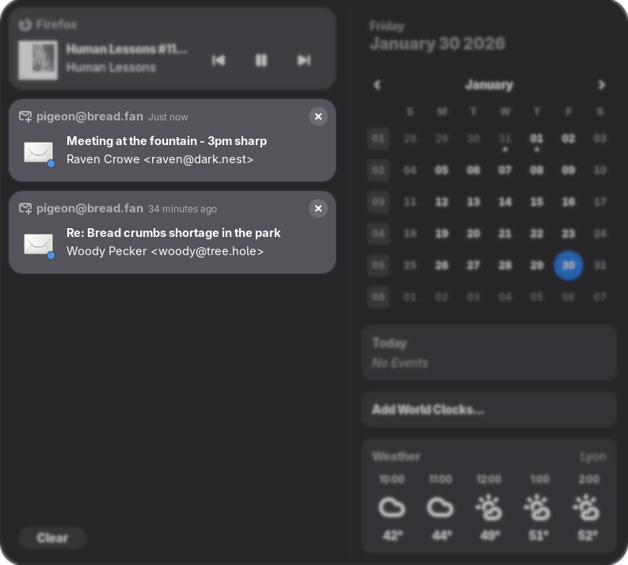

# Pigeon Email Notifier

[](LICENSE)
[](https://gitlab.gnome.org/GNOME/gnome-shell)

A GNOME Shell extension for email notifications using GNOME Online Accounts.



## Features

- Gmail and Microsoft support via GNOME Online Accounts
- Desktop notifications for new emails
- Priority-only mode for important emails (disabled by default)
- Persistent notifications (disabled by default)
- Sound notification (disabled by default)
- Click notification to open email in browser or launch default mail client

## Limitations

- Exchange and IMAP accounts are not supported

## Requirements

- GNOME Shell 48 or later
- A Google or Microsoft account configured in GNOME Online Accounts **Settings > Online Accounts**
- **Ubuntu users:** `sudo apt install gir1.2-goa-1.0 gir1.2-xmlb-2.0`

## Installation

### From extensions.gnome.org

[](https://extensions.gnome.org/extension/9301/pigeon-email-notifier/)

### Manual

```bash
git clone https://github.com/subz69/pigeon 
cd pigeon
make install
```

Then restart GNOME Shell and enable the extension.

## Troubleshooting

**No notifications appearing?**
- Ensure you have Gmail or Microsoft accounts added in Settings > Online Accounts
- Check that accounts are enabled and authorized

**Unable to check emails?**
- Re-authenticate your account in Settings > Online Accounts
- Remove and re-add the account if issues persist
- View logs: `journalctl --grep="pigeon"` for details

**Found a bug or issue?**

Please [open an issue](https://github.com/subz69/pigeon/issues) with the relevant output of:
```bash
journalctl --grep="pigeon"
```

## Contributing

### Translations

Pigeon supports internationalization. To add a new translation:

1. Generate a new translation template:
   ```bash
   make new-po LANG=xx  # Replace 'xx' with your language code (e.g., ja, nl, ru)
   ```

2. Edit the generated `po/xx.po` file with your translations

3. Test your translation:
   ```bash
   make install
   ```

4. Submit a pull request with your `po/xx.po` file

## Credits

Based on [gnome-email-notifications](https://github.com/shumingch/gnome-email-notifications) by Shuming Chan, Stuart Langridge and Adam Jablonski. Complete rewrite for GNOME Shell 48+.

Logo based on [Animal Pack Redux](https://kenney.nl/assets/animal-pack-redux) by Kenney.nl (CC0).

## License

Copyright (C) 2026 subz69  
Licensed under [GPL-2.0-or-later](LICENSE).
